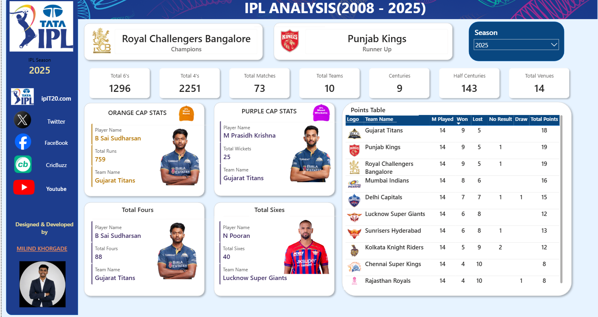
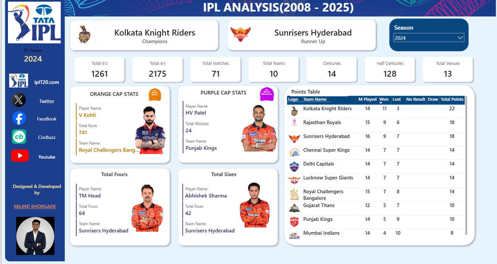

<h1 align="center">🏏 IPL Analysis Dashboard (2008–2025)</h1>

<p align="center">
A fully interactive Power BI dashboard providing comprehensive IPL insights from 2008 to 2025 using Power BI, DAX, Power Query and Data Modeling.
</p>

<p align="center">






</p>

---

# 📸 Dashboard Preview

<p align="center">


</p>

---

# 📖 Project Overview

The **IPL Analysis Dashboard (2008–2025)** is a complete Business Intelligence project developed using **Microsoft Power BI**.

This dashboard enables users to analyze every IPL season dynamically through an interactive interface. Users can explore championship history, batting records, bowling records, team performance, points table, venue statistics and many other KPIs.

The dashboard is completely dynamic, meaning every visual, image and statistic updates automatically whenever a season is selected.

---

# 🚀 Features

## 📊 Fully Dynamic Dashboard

- Dynamic Season Selection (2008–2025)
- Automatic Visual Updates
- Interactive Slicers
- Dynamic KPI Cards
- Responsive Dashboard Layout

---

## 🏆 Championship Analysis

- Season Champion
- Runner-Up
- Champion Team Logo
- Runner-Up Team Logo

---

## 🟠 Orange Cap Analysis

- Orange Cap Holder
- Total Runs
- Player Image
- Team Name

---

## 🟣 Purple Cap Analysis

- Purple Cap Holder
- Total Wickets
- Player Image
- Team Name

---

## 💥 Batting Statistics

- Most Fours
- Most Sixes
- Total Centuries
- Total Half Centuries

---

## 📈 Team Performance

- Matches Played
- Matches Won
- Matches Lost
- No Result
- Draw Matches
- Total Points

---

## 📋 Interactive Points Table

- Team Logos
- Matches Played
- Won
- Lost
- No Result
- Draw
- Total Points

---

## 📌 Dashboard KPIs

- Total Matches
- Total Teams
- Total Venues
- Total Fours
- Total Sixes
- Centuries
- Half Centuries

---

## 🖼 Dynamic Images

The dashboard automatically changes

- Champion Logo
- Runner-Up Logo
- Orange Cap Holder Image
- Purple Cap Holder Image
- Team Logos

according to the selected season.

---

## 🔗 External Navigation Buttons

The dashboard contains clickable buttons for

- 🏏 Official IPL Website
- 🐦 Twitter (X)
- 📘 Facebook
- 📺 YouTube
- 📰 Cricbuzz

allowing users to directly access IPL-related platforms.

---

## 🎨 Professional Dashboard Design

- Modern UI
- Sidebar Navigation
- Custom Icons
- Rounded Cards
- Interactive Layout
- Team Branding
- Dynamic Images
- Clean Professional Theme

---

# 🛠 Technologies Used

| Technology | Purpose |
|------------|----------|
| Microsoft Power BI | Dashboard Development |
| DAX | Business Calculations |
| Power Query | Data Cleaning & ETL |
| Data Modeling | Relationships |
| CSV Dataset | IPL Data |
| Git | Version Control |
| GitHub | Repository Hosting |

---

# 📂 Dataset Used

The project uses multiple IPL datasets including:

- IPL Matches Data
- Ball-by-Ball Data
- Team Information
- Player Information
- Team Logos
- Player Images

---

# 🧠 Advanced DAX Concepts Used

- VAR
- CALCULATE()
- FILTER()
- SUMMARIZE()
- ADDCOLUMNS()
- CALCULATETABLE()
- LOOKUPVALUE()
- RELATED()
- USERELATIONSHIP()
- VALUES()
- COUNTROWS()
- MAX()
- MAXX()
- IF()
- SELECTEDVALUE()
- Table Expressions
- Dynamic Measures
- Context Transition

---

# 📊 Major DAX Measures Created

- Season Winner
- Season Winner Logo
- Runner-Up
- Runner-Up Logo
- Orange Cap Holder
- Orange Cap Image
- Orange Cap Team
- Orange Cap Runs
- Purple Cap Holder
- Purple Cap Image
- Purple Cap Team
- Purple Cap Wickets
- Total Matches
- Matches Won
- Matches Lost
- Total Fours
- Total Sixes
- Total Centuries
- Total Half Centuries
- Points Table Measures

---

# 🔄 Power Query Operations

- Data Cleaning
- Data Transformation
- Remove Null Values
- Change Data Types
- Rename Columns
- Merge Queries
- Create Relationships
- Data Preparation

---

# 📊 Dashboard Sections

### 🏆 Champions

- Winner
- Runner-Up
- Team Logos

---

### 🟠 Orange Cap

- Player Name
- Runs
- Team
- Dynamic Image

---

### 🟣 Purple Cap

- Player Name
- Wickets
- Team
- Dynamic Image

---

### 💥 Boundary Statistics

- Most Fours
- Most Sixes

---

### 📈 Team Statistics

- Matches Played
- Won
- Lost
- No Result
- Draw
- Points

---

### 📋 Points Table

- Team Logo
- Team Name
- Matches Played
- Won
- Lost
- No Result
- Draw
- Total Points

---

# 📂 Folder Structure

```
IPL-Analysis-PowerBI
│
├── Dashboard
│   └── IPL Analysis.pbix
│
├── Dataset
│   ├── ball_by_ball_data.csv
│   ├── ipl_matches_data.csv
│   ├── players-data.csv
│   └── teams_data.csv
│
├── Images
│   ├── dashboard.png
│   ├── orange_cap.png
│   ├── purple_cap.png
│   ├── winner.png
│   ├── runnerup.png
│   └── points_table.png
│
├── README.md
└── LICENSE
```

---

# 🚀 How to Use

### Clone Repository

```bash
git clone https://github.com/YOUR_USERNAME/IPL-Analysis-PowerBI.git
```

Open

```
Dashboard/IPL Analysis.pbix
```

using

```
Microsoft Power BI Desktop
```

---

# 🌟 Dashboard Highlights

✅ Fully Dynamic Dashboard

✅ Season-wise Analysis (2008–2025)

✅ Dynamic Player Images

✅ Dynamic Team Logos

✅ Dynamic Winner & Runner-Up

✅ Interactive Points Table

✅ Advanced DAX Measures

✅ Power Query Transformations

✅ Professional UI

✅ External Website Navigation

✅ Responsive Dashboard

---

# 💡 Business Insights

This dashboard helps users understand

- Championship Trends
- Team Performance
- Batting Dominance
- Bowling Dominance
- Boundary Statistics
- Season Comparison
- Team Rankings
- Player Performance

---

# 📈 Future Improvements

- Venue Analysis
- Toss Analysis
- Match Prediction using Machine Learning
- Player Comparison Dashboard
- AI-powered Insights
- Mobile Layout
- Live IPL Data Integration
- Performance Trends

---

# 🤝 Connect With Me

**Milind Khorgade**

🎓 B.Tech Artificial Intelligence & Machine Learning

📍 Ramdeobaba University

💼 LinkedIn: https://www.linkedin.com/in/milind007k/

🐙 GitHub: https://github.com/milind007K

---

<p align="center">

Made with ❤️ using Microsoft Power BI

</p>
---

# ⭐ If you like this project

Give this repository a ⭐ on GitHub.
